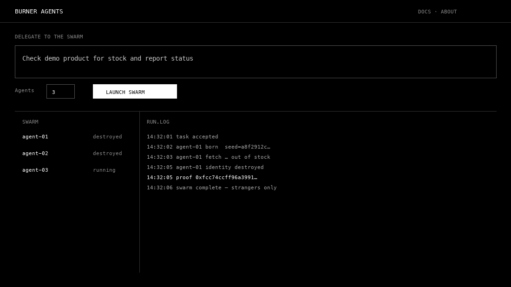

# Burner Agents

Delegate tasks to a swarm of disposable agents. The web sees unrelated strangers, not you. Each agent is born for one job and destroyed when done.




```bash
make demo
# open http://127.0.0.1:8090/
```

Read the thesis: [docs/burner_whitepaper.pdf](docs/burner_whitepaper.pdf). Platform overview: [docs/vision.md](docs/vision.md).

## Why

Sites profile you by IP, fingerprint, and behavior. One persistent watcher is easy to block. Linked sessions are easy to attribute back to you. Burner Agents separates **you** from **what the web sees**: a crowd of strangers that never forms a single profile.

## How it works

```
     YOU  -->  orchestration (private)  -->  THE WALL  -->  swarm  -->  THE WEB
```

| Layer | What it means |
|-------|----------------|
| Isolation | Fresh fingerprint and proxy per agent; destroyed after the task |
| Reasoning | You describe intent; agents execute on live URLs (scripted runner today) |
| Orchestration | Fan-out, live log, proof on destroy. Coordination stays off the public web |

```
burner-agents/
├── demo/
│   ├── console/            # product UI: delegate, swarm, RUN.LOG
│   └── test-product/       # local page for demos
├── services/
│   ├── orchestrator/       # delegate API, SSE, sentinel webhooks
│   ├── identity/           # disposable identity per agent
│   └── buy-assist/         # checkout assist under a clean identity
├── docs/                   # whitepaper, vision, demo script
└── docker-compose.yml      # optional restock sentinel stack
```

| Today | Roadmap |
|-------|---------|
| Swarm console, identity rotation, destruction proofs | LLM intent parsing |
| HTTP fetch against demo product | CloakBrowser per agent |
| Stub $BURNER meter | On-chain metering |

## Try it

**Console (fastest path, no Docker)**

```bash
make demo
open http://127.0.0.1:8090/
```

Choose **Check demo product** or type a task, set agent count, click **LAUNCH SWARM**.

**Application: restock sentinel (Docker)**

```bash
cp .env.example .env
docker compose up -d
./scripts/setup-watch.sh
./scripts/flip-stock.sh
```

Uses changedetection.io for diffs, webhooks, and optional Discord or Telegram alerts. See [docs/burner-sentinel-spec.md](docs/burner-sentinel-spec.md).

## Capabilities

| Capability | What it does |
|------------|----------------|
| Swarm delegation | Fan out N disposable agents from one intent |
| Disposable identity | New seed, user agent, and optional proxy per agent |
| Destruction proof | Commitment hash logged when an identity is torn down |
| Live orchestration log | SSE stream of spawn, fetch, and destroy events |
| Restock sentinel (app) | Watch a product, alert on change, assist checkout on the drop |
| Usage metering | Stub $BURNER meter for watches and buy-assists |

## Development

```bash
cd services/orchestrator && python3.11 -m venv .venv && source .venv/bin/activate
pip install -r requirements.txt
PYTHONPATH=.:..:../identity:../buy-assist pytest -q
```

From repo root (matches CI):

```bash
pip install -r services/orchestrator/requirements.txt pytest
PYTHONPATH=services:services/orchestrator:services/identity:services/buy-assist \
  pytest services/orchestrator/tests services/identity/tests -q
```

See [CONTRIBUTING.md](CONTRIBUTING.md).

## Status and licensing

**Prototype.** changedetection.io has Apache-2.0 core plus separate commercial terms. Clarify license before paid or production use of the sentinel stack.

**Buy-assist only.** Monitor, alert, and assist the user's own checkout. No autonomous mass-purchase or resell automation.

## License

MIT. See [LICENSE](LICENSE). changedetection.io is a separate upstream project driven via REST API only.

---

**GitHub About (set in repo Settings):** Delegate to a swarm of disposable agents. The web sees strangers, not you.

**Topics:** `agents`, `privacy`, `web-automation`, `orchestration`, `python`, `restock-alerts`

**Social preview:** upload [docs/assets/social-preview.png](docs/assets/social-preview.png) under Settings → General → Social preview.
